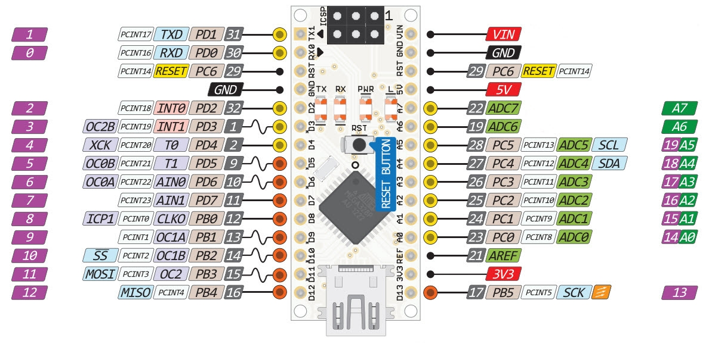

Simple FTDI UM201XB or Holtek HT42B532-x replacement.

By default it act as UM201XB TWI/I2C slave device at the address 0x22.
It passes all data TWI -> UART only.

For a Holtek the TWI address must be changed to be current one.

TWI speed is set to be max. 400kbit and maximal length
of the single transfer 64 bytes. It can be easly changed in twi.h.

Checked with a boards:
- Arduino Nano ATMega168 (1Mbit UART with CH340G)
- Arduino Nano3 compatible LGT8F328P (460kbit UART with HT42B534-1)

Connections:
- SCL (A5)
- SDA (A4)
- GND

Project uses twi.c - TWI/I2C library for Wiring & Arduino
Copyright (c) 2006 Nicholas Zambetti

Packages for LGT8F328P
https://raw.githubusercontent.com/dbuezas/lgt8fx/master/package_lgt8fx_index.json
for ATMega8/168
https://mcudude.github.io/MiniCore/package_MCUdude_MiniCore_index.json
